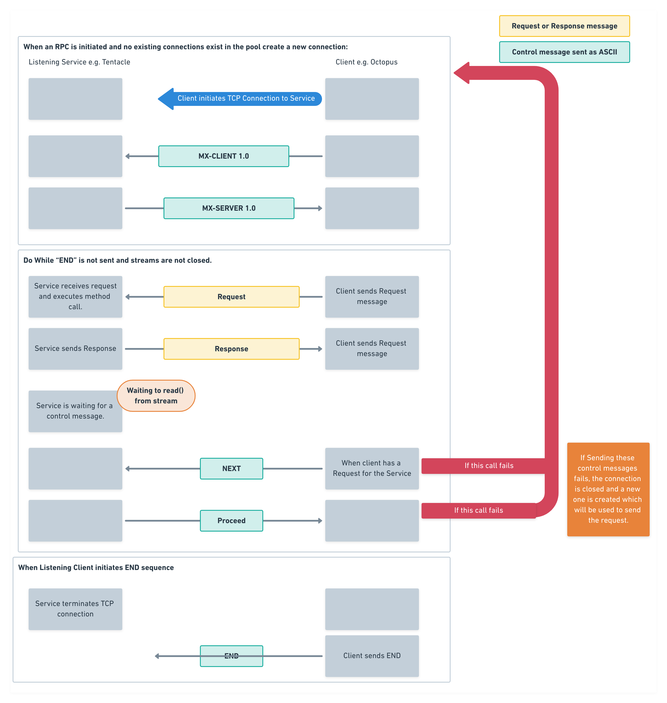
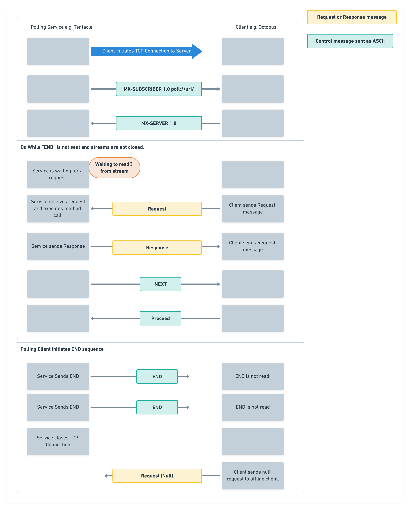
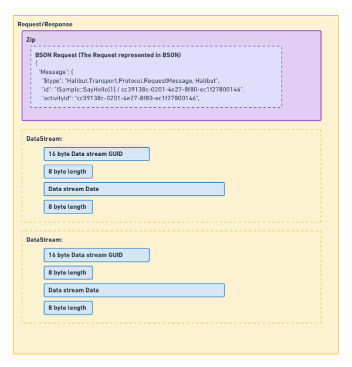
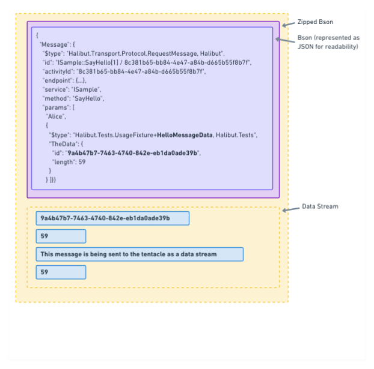
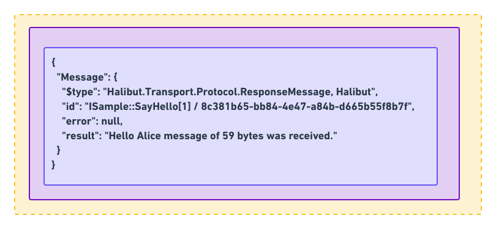

# Halibut Protocol data exchange

This document outlines the data that is exchanged between the **Client** and **Service**. In this document:

 - **Client** is what makes the remote procedure calls e.g. Octopus Server.
 - **Service** is what executes the methods e.g. Tentacle. 


When invoking a remote method in both polling and listening mode, the `Client` and `Service` go through three stages.

 ### Stage 1 - Identification
 
  A TCP connection is established and both Service and client identify themselves, through a series of control messages. The control messages sent vary depending on if [listening](#listening-service-protocol-data-exchange) or [polling](#polling-service-protocol-data-exchange) mode is used.

### Stage 2 - Message exchange

Now that the connections are established, the Service will wait for requests from the Client. In both polling and listening the following steps are repeated in order:

1. The Client sends a `Request` message containing the method to execute, its parameters and 0 or more data streams.
2. The Service executes the method and sends the result in a `Response` message containing the result and 0 or more data streams.
3. The Service and Client exchange `NEXT` and `PROCEED` control messages. The direction of these message differes depending on if the service is in polling or listening mode.


The steps are repeated for both Listening and Polling mode until either Client or Service begins the Ending a connection stage.

### Stage 3 - Ending a connection

The final stage can be entered by either the Client or Service terminating the TCP connection or sending a `END` control message. Once this stage is reached no more requests will be processed in the current TCP connection.

## Listening Service protocol data exchange

In listening mode the *Client* will keep and pool connections for subsequent RPC calls. In this mode the "pooled connection" is tested by sending and recieving control messages before sending the Request message. If the control messages can not be exchanaged a new connection is made.

1. *Identification:*
    1. **Client** identifies itself as `MX-CLIENT 1.0`
    2. **Service** identifies itself as `MX-SERVER 1.0`
2. *Message exchange:*
    1. The **Client** sends a `Request` message containing the method to execute, its parameters and 0 or more data streams.
    2. The **Service** executes the method and sends the result in a `Response` message containing the result and 0 or more data streams.
    3. The **Client** places the TCP connection into the pool
    4. The **Service** waits for a control message.
3. *Connection re-use: When the Client wants to make a new RPC call:*
    1. A connection is removed from the pool and tested by:
        1. The Client sends a `NEXT` control message.
        2. The Service responds witha `PROCEED` control message.
    2. If the client is unable to send `NEXT` or recieve the `PROCEED` control message, the TCP connection is clossed and a new one created following the process from step `1.Identification`.
    3. If the client recieves `PROCEED` the RPC call is made with this TCP connection starting at step `2.Message exchange`.




## Polling Service protocol data exchange

To make RPC calls the steps are:

1. *Identification:*
    1. **Service** identifies itself as `MX-SUBSCRIBER 1.0`
    2. **Client** identifies itself as `MX-SERVER 1.0`
2. *Message exchange:*
    1. The Client sends a `Request` message containing the method to execute, its parameters and 0 or more data streams.
    2. The Service executes the method and sends the result in a `Response` message containing the result and 0 or more data streams.
3. *Connection re-use:*
    1. The **Service** sends a `NEXT` control message.
    2. The **Client** responds with a `PROCEED` control message.
    3. The **Service** Waits for a **Request** message.
    4. When the **Client** makes a new RPC call the same TCP connection is re-used and the process starts again at step `2.Message exchange`.

Under polling mode, unlike listening, the Client will periodically send a no-op NUL Request to the Service to keep the TCP connection alive.



## Request and Response message format

The message format is always a Zipped BSON representation of either the [Request](../source/Halibut/Transport/Protocol/RequestMessage.cs) or [Response](../source/Halibut/Transport/Protocol/ResponseMessage.cs) message, followed by zero or more [DataStreams](../source/Halibut/DataStream.cs). A `DataStream` represents data that should not be serialized as part of a message, for example a file to be transferred. They can be sent in either a request or a response. `DataStream`s are transferred as raw bytes in the TCP stream (i.e. they are not compressed) and are sent sequentially after the compressed BSON of the request/response. Each `DataStream` has a unique GUID which is referenced in the request/response so that it can be used by calling code.




### Example 

Below is an example of the Request and Response messages when making a simple RPC with Halibut.

For a RPC call made with
```
public interface ISample
{
    public string SayHello(string message, DataStream theData);
}

public class HelloMessageData
{
    public DataStream TheData { get; set; }
}

// Example call
var data = "This message is being sent to the tentacle as a data stream".ToUtf8();

var response = echo.SayHello("Alice", DataStream.FromBytes(data));
```

The resulting Request



The resulting response




## Inspiration

Halibut's protocol was inspired by JSON-RPC, read its [history here](https://www.codeproject.com/Articles/554692/Halibut-a-secure-communication-stack-for-NET-Mono).

## Links

[Diagrams src](https://whimsical.com/halibut-protocol-S4zyHWADysGLbqcFxUQK3V)